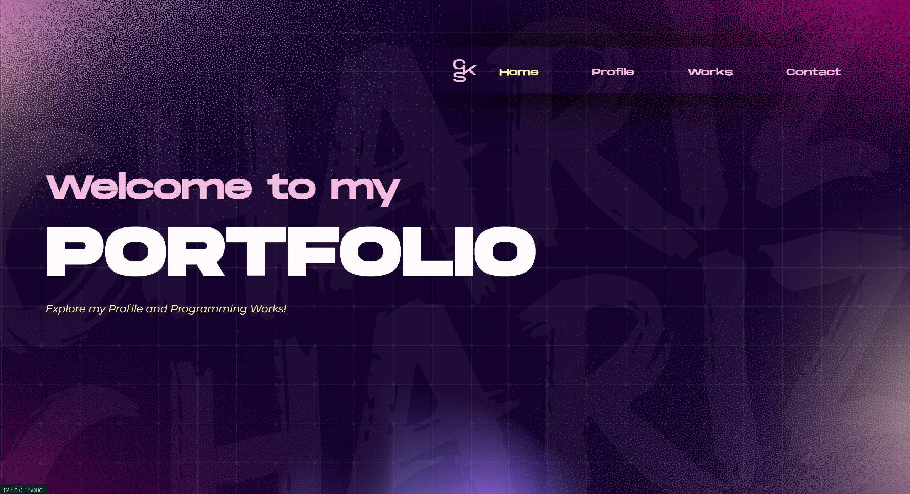
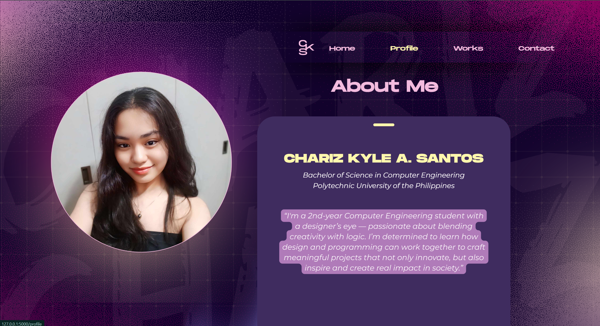
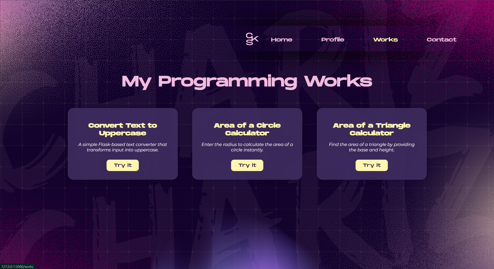
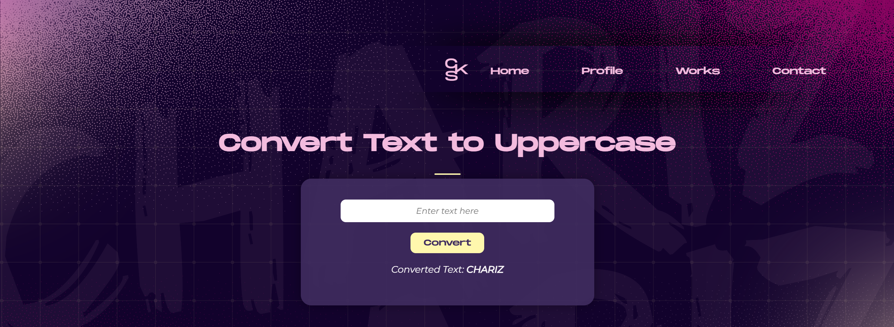
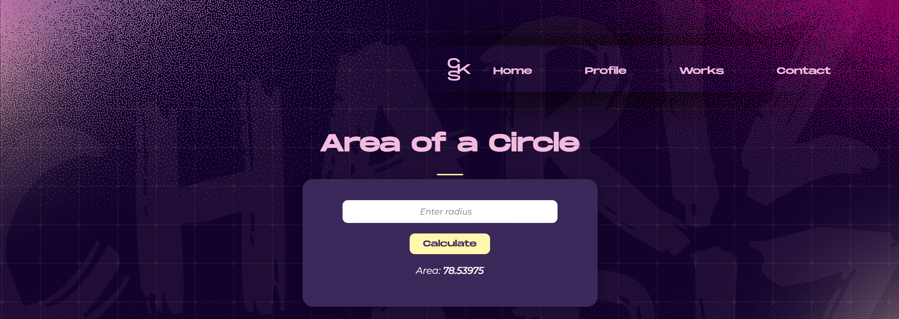
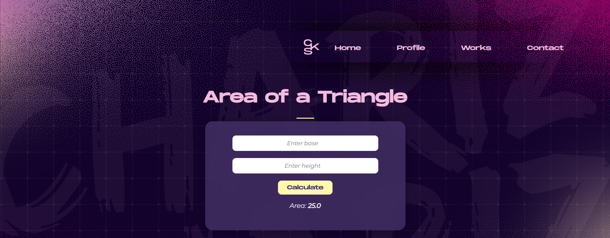
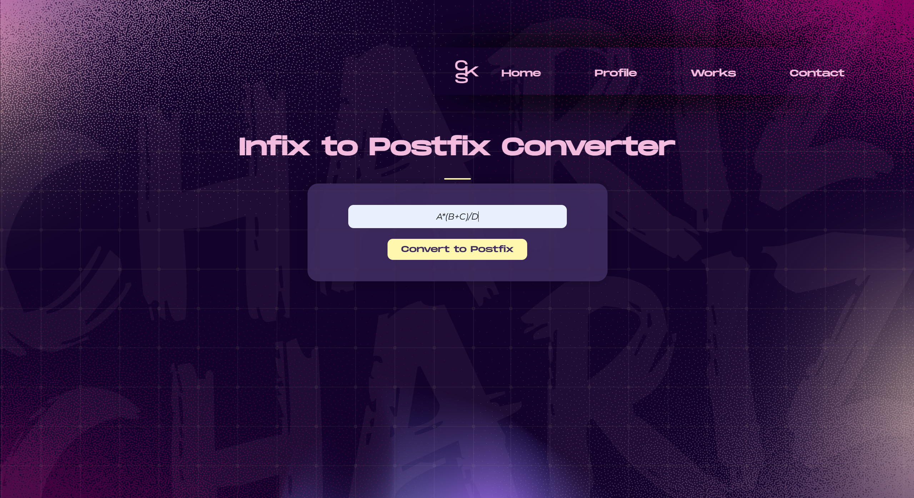
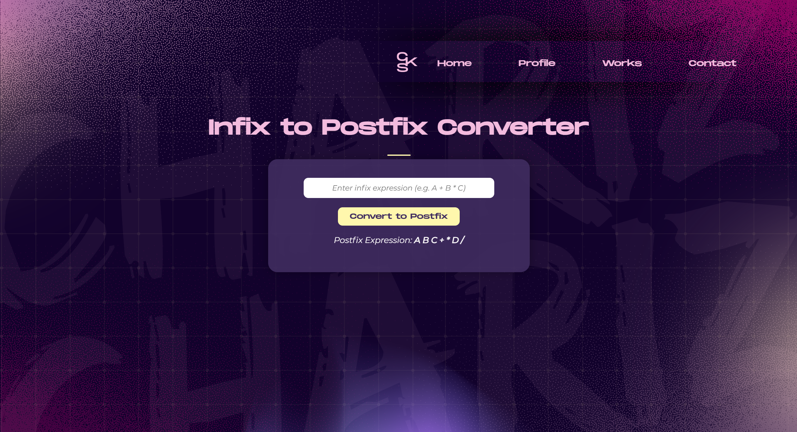
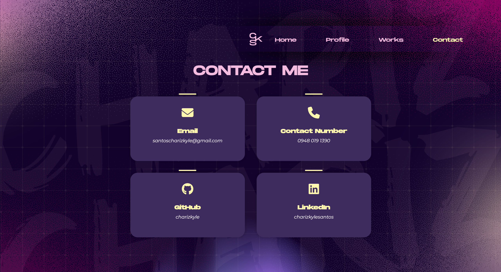

---

# 💜 Welcome to My Website Portfolio 🩷

Welcome to my **Website Portfolio** — an interactive showcase of my programming works!

Hello! I’m **Chariz Kyle A. Santos**, a second-year Computer Engineering student with a keen eye for design and a passion for blending creativity with logic. I aim to explore how design and programming can work hand in hand to develop meaningful projects that innovate, inspire, and create a positive impact on society.

---

## 🧭 Organized Structure  
- `static/css/style.css` for styling  
- `static/fonts/` for custom typefaces  
- `static/images/` for visuals and backgrounds  
- `index.html` (or main template) for page layout  

---

## 🟪 Preview
  










---

## 🧩 Folder Structure

```

MY_PORTFOLIO/
│
├── app.py
├── Flask_HTML.ipynb
├── README.md
│
├── static/
│   ├── css/
│   │   └── style.css
│   │
│   ├── fonts/
│   │   ├── Montserrat-Italic.woff2
│   │   ├── Montserrat-Regular.woff2
│   │   ├── MonumentExtended-Regular.otf
│   │   └── MonumentExtended-Ultrabold.otf
│   │
│   └── images/
│       ├── background.png
│       ├── cks-pink.png
│       ├── about-me.png
│       ├── profile-photo.png
│       ├── *-preview.png (page screenshots)
│
└── templates/
    ├── components/
    │   └── header.html
    │
    ├── index.html
    ├── profile.html
    ├── works.html
    ├── contact.html
    ├── touppercase.html
    ├── area_circle.html
    └── area_triangle.html


```

---

## 🖋️ Typography

| Font | Use | Style |
|------|------|-------|
| **Monument Extended** | Headings / Logos | Bold, impactful |
| **Montserrat** | Paragraphs / Body | Clean, modern |

> Both fonts are included locally under `static/fonts/`.

---

## 🧠 Technologies Used

- **HTML5**
- **CSS3**
- **Canva** for design layout
- *(Optional)* **Python (Flask/Django)** for backend logic  
- **VS Code** as the main development environment

---

## 🚀 Getting Started

1. **Clone this repository:**
   ```bash
   git clone https://github.com/charizkyle/my_portfolio.git
    ```

2. **Open in VS Code**
3. **Run your project**

   * If static HTML/CSS → just open `index.html` in your browser
   * If Flask/Django → run `python app.py` or `python manage.py runserver`

---

## ❤️ Credits

Fonts used:

* **Montserrat-Regular**
* **Montserrat-Italic**
* **Monument Extended Regular**
* **Monument Extended Ultrabold**


Background image:

* Custom design (`background.png`)

---

> “Design is not just what it looks like and feels like — design is how it works.”
> — *Steve Jobs*

---

```
